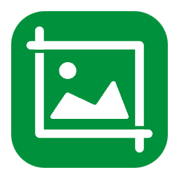

# [WIP] iCap 

A macOS App for screenshot  using Latest Swift/SwiftUI and ScreenCapturekit. 

## Features

- [ ] keyboard shortcut to capture screenshot
- [ ] screen area selection
- [ ] save screenshot to local
- [ ] border shadow effect

