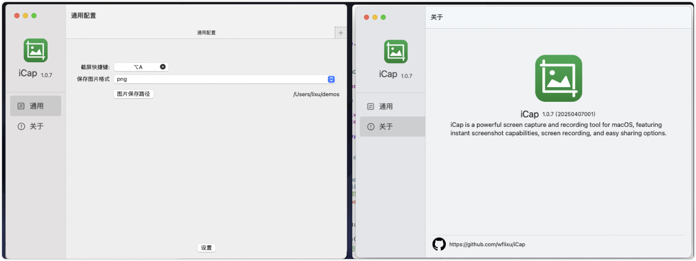

<div align="center">


# iCap

**一款使用纯 Swift 构建的现代化 macOS 截图工具**

[](https://swift.org/)
[](https://developer.apple.com/xcode/swiftui/)
[](https://www.apple.com/macos/)
[](LICENSE)

[English](README.md) | [中文文档](README_CN.md)

</div>

## ✨ 功能特性

- **📸 截图功能**
  - 全屏和自定义区域选择
  - 全局快捷键支持
  - 使用 ScreenCaptureKit 实现高质量截图

- **✏️ 图片编辑**
  - 多种标注工具（文本、形状、箭头、马赛克等）
  - 裁剪和调整大小功能
  - 边框和阴影效果

- **💾 灵活保存**
  - 保存到本地自定义路径
  - 复制到剪贴板
  - 将截图固定到浮动窗口

- **🎨 现代化界面**
  - 原生 SwiftUI 界面
  - 流畅的动画和过渡效果
  - 深色模式支持

## 📋 系统要求

- **操作系统:** macOS 15.0 (Sequoia) 或更高版本
- **Xcode:** 15.0 或更高版本
- **Swift:** 5.10 或更高版本

## 🚀 安装

### 下载发布版本

1. 访问 [Releases](https://github.com/wflixu/iCap/releases) 页面
2. 下载最新的 `.dmg` 文件
3. 打开文件并将 iCap 拖拽到应用程序文件夹
4. 根据提示授予屏幕录制权限

### 从源码构建

```bash
# 克隆仓库
git clone https://github.com/wflixu/iCap.git
cd iCap

# 在 Xcode 中打开
open iCap.xcodeproj

# 构建并运行 (⌘R)
```

## 📖 使用指南

### 快速开始

1. **启动 iCap** - 首次启动时授予屏幕录制权限
2. **截取屏幕** - 使用全局快捷键（默认：`⌘⇧X`）
3. **选择区域** - 拖拽选择屏幕区域
4. **添加标注** - 使用左侧面板的工具进行标注
5. **保存图片** - 选择保存方式

### 键盘快捷键

| 快捷键 | 操作 |
|--------|------|
| `⌘⇧X` | 截取屏幕 |
| `Esc` | 取消选择 |
| `⌘Z` | 撤销标注 |
| `⌘⇧Z` | 重做标注 |

### 截图预览

<div align="center">
  
</div>

## 🛠️ 开发

### 构建命令

```bash
# Debug 构建
xcodebuild -project iCap.xcodeproj -scheme iCap -configuration Debug build

# Release 构建
xcodebuild -project iCap.xcodeproj -scheme iCap -configuration Release build

# 运行测试
xcodebuild test -project iCap.xcodeproj -scheme iCap -destination 'platform=macOS'
```

### 项目结构

```
iCap/
├── iCapApp.swift          # 主程序入口
├── AppState.swift         # 全局状态管理
├── Editor/                # 图片编辑组件
│   ├── CanvasView.swift
│   ├── AnnotationManager.swift
│   └── EditorView.swift
├── Shared/                # 共享工具
│   ├── EventBus.swift     # 事件系统
│   ├── Constants.swift
│   └── Utils.swift
└── Assets.xcassets        # 应用资源
```

### 核心技术

- **SwiftUI** - 现代化 UI 框架
- **ScreenCaptureKit** - 屏幕捕获 API
- **Combine** - 响应式编程
- **KeyboardShortcuts** - 全局快捷键

## 🤝 贡献

欢迎贡献代码！请遵循以下步骤：

1. Fork 本仓库
2. 创建您的特性分支 (`git checkout -b feature/amazing-feature`)
3. 提交您的更改 (`git commit -m 'Add some amazing feature'`)
4. 推送到分支 (`git push origin feature/amazing-feature`)
5. 开启 Pull Request

详情请阅读我们的[贡献指南](CONTRIBUTING.md)。

## 📝 许可证

本项目采用 MIT 许可证 - 详见 [LICENSE](LICENSE) 文件。

## 🙏 致谢

- 使用 [SwiftUI](https://developer.apple.com/xcode/swiftui/) 构建
- 使用 [ScreenCaptureKit](https://developer.apple.com/documentation/screencapturekit) 进行屏幕捕获
- 图标来自 [SF Symbols](https://developer.apple.com/sf-symbols/)
- 快捷键管理使用 [KeyboardShortcuts](https://github.com/soffes/KeyboardShortcuts)

## 📮 联系与支持

- **问题反馈:** [GitHub Issues](https://github.com/wflixu/iCap/issues)
- **讨论交流:** [GitHub Discussions](https://github.com/wflixu/iCap/discussions)

---

<div align="center">
  <sub>由 <a href="https://github.com/wflixu">@wflixu</a> 用 ❤️ 构建</sub>
</div>
